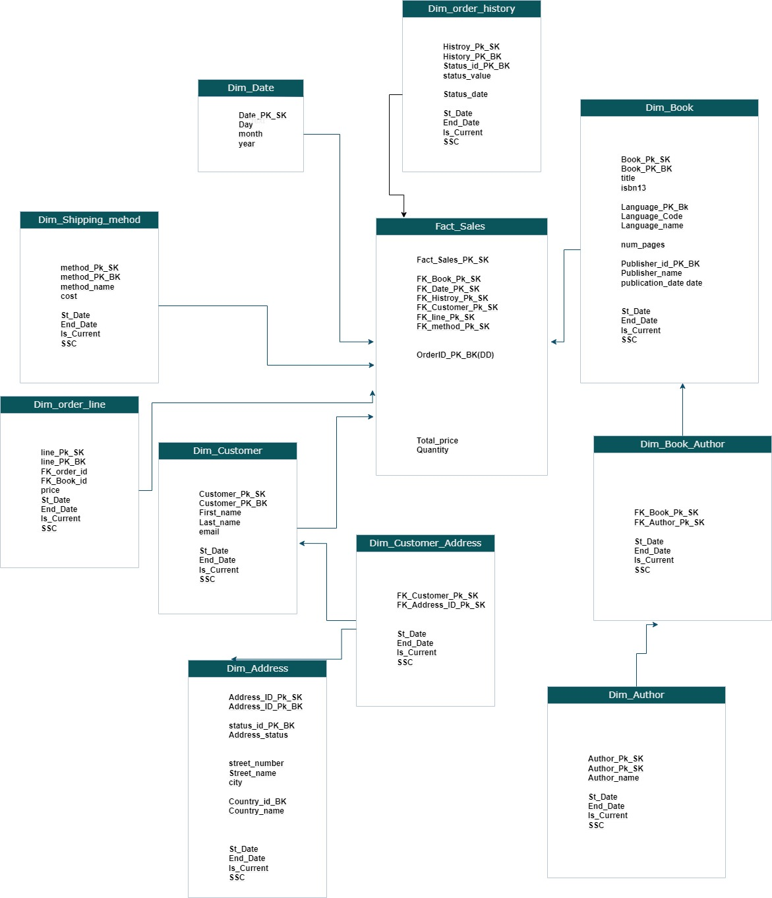

# Gravity Books Data Warehouse (2024)

## Description:
The **Gravity Books Data Warehouse** uses a **Snowflake Schema** to organize and analyze sales, customer, order, and shipping data. It includes **Fact** and **Dimension** tables with normalized structures, enabling efficient reporting and business insights on books, authors, and customer behavior.

## Repository Structure:
- **Fact Table**:
  - `Fact_Sales`: Contains metrics like price and quantity.
- **Dimension Tables**:
  - `Dim_Order_History`: Tracks order status and history.
  - `Dim_Shipping_Method`: Information on shipping methods.
  - `Dim_Order_Line`: Details of each order line.
  - `Dim_Book`: Book-related data (title, ISBN, publisher).
  - `Dim_Author`: Information on authors.
  - `Dim_Book_Author`: Many-to-many relationship between books and authors.
  - `Dim_Customer`: Customer information.
  - `Dim_Address`: Customer address details.
  - `Dim_Customer_Address`: Relationship between customers and addresses.
  - 

## Additional Files:
- **Excel Modeling Map**: Contains the data model diagram and relationships between tables.
- **SQL Query Scripts**: Includes the SQL scripts to create the data warehouse schema (tables, foreign keys, etc.).
- **Modeling Diagrams**: Visual representations of the database schema, including the snowflake design and relationships between tables.

## Design Overview:
This data warehouse follows a **Snowflake Schema** design, with **normalized dimensions** and fact tables to ensure efficient storage and querying. **Sub-dimensions** are used to reduce redundancy (e.g., `Dim_Customer` split into `Dim_Customer_Address` and `Dim_Address`).

## Key Features:
- **Normalized Structure**: Reduces redundancy, ensuring efficiency in storage and querying.
- **Snowflake Schema**: Enhances performance by organizing data in a hierarchical structure.
- **Business Intelligence Ready**: Can be integrated with tools like **Power BI** for analysis.

## Usage:
This repository provides SQL scripts for building the data warehouse, which can be loaded into your database. The schema is designed to support reporting and analysis of business data, such as customer purchases, shipping methods, and product sales.

## Setup Instructions:
1. Clone this repository to your local machine:
    ```bash
    git clone https://github.com/MohamedRoshdyDataENG/Gravity-Books-Data-Warehouse-2024-
    ```
2. Run the SQL scripts provided in the repository to set up the database tables and relationships.
3. Use **SSIS**, **Power BI**, or other BI tools to connect to the data warehouse for reporting and analysis.


